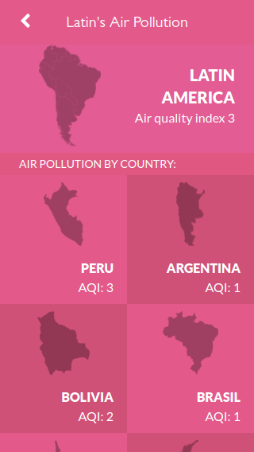

# Latin America's Air Pollution Project

In this project, I set up my Metrics WebApp project. It is a mobile web application to check a list of metrics about Latin America's Air Pollution.

## Screenshot

## :red_circle: Live Demo

- [Preview Link](https://latinamerica-air-pollution.netlify.app/#/)
## :hammer: Built With

- REACT and REDUX.

To get a local copy up and running follow these simple steps:

1. Go to the [repository page](https://github.com/ArthurGC/Latin_America_Air_Pollution).
2. Press the "Code" button and copy the link.
3. Clone it using git command `git clone <link>`.
4. Run `npm install` to install the packages and dependencies.

To run the tests:

- Run `npm run test` on a Terminal.

## :blue_book: Learning Objectives

- Use React documentation.
- Use React components.
- Use React props.
- Use React Router.
- Connect React and Redux.
- Handle events in a React app.
- Write integration tests with a React testing library.
- Use styles in a React app.
- Use React life cycle methods.
- Apply React best practices and language style guides in code.
- Use store, actions and reducers in React.

## Authors

👤 **ArthurGC**

- GitHub: [@ArthurGC](https://github.com/ArthurGC)

## 🤝 :raised_hand: :raised_hand: Contributions

Contributions, issues, and feature requests are welcome!

Feel free to check the [issues page](https://github.com/ArthurGC/Latin_America_Air_Pollution/issues).

## :grey_exclamation: Acknowledgments

- [Microverse](https://www.microverse.org/)

## 📝 License

This project is [MIT](LICENSE) licensed.
